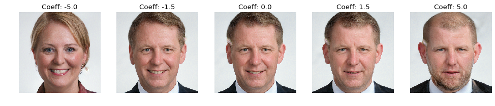

# Face Maker



This project allows you to generate and manipulate face images using StyleGAN. You can explore the latent space of StyleGAN to change facial attributes like age, gender, smile, and more.

## Features

*   **Generate realistic face images**: Leverages a pre-trained StyleGAN model to synthesize high-quality faces.
*   **Edit facial attributes**: Modify existing faces (or generated ones) by manipulating their latent representations.
    *   Change attributes such as age, gender, expression (e.g., smile).
*   **Encode existing images**: Project real face images into StyleGAN's latent space to enable their manipulation.
*   **Discover semantic directions**: Includes tools or examples for finding directions in the latent space that correspond to meaningful facial characteristics.

## Core Components

*   **StyleGAN Generator**: The core model (likely FFHQ pre-trained) used for image synthesis.
*   **Image Encoder**: Models (e.g., EfficientNet, ResNet) trained to map input images to StyleGAN's latent space (W or W+). This allows editing of user-provided images.
*   **Latent Direction Vectors**: Pre-computed or dynamically discoverable vectors (e.g., `smile.npy`, `gender.npy`, `age.npy`) that, when added to a face's latent code, modify a specific attribute.
*   **Manipulation Scripts/Notebooks**:
    *   `face_changer.py`: A script to load a latent vector, apply a directional change, and visualize the results.
    *   `Play_with_latent_directions.ipynb`: Likely an interactive notebook for exploring latent space manipulations.
    *   `Learn_direction_in_latent_space.ipynb`: A notebook probably dedicated to the methodology of finding semantic directions.
    *   `StyleGAN_Encoder_Tutorial.ipynb`: A tutorial on encoding images into StyleGAN's latent space.

## How it Works

1.  **Image Encoding (for existing images)**: An encoder network (e.g., trained EfficientNet or ResNet) takes an input face image and predicts its corresponding latent vector in StyleGAN's W or W+ space.
2.  **Latent Vector Manipulation**: To change a facial attribute (e.g., add a smile), a pre-calculated direction vector for "smile" is added (with a certain coefficient) to the image's latent vector.
3.  **Image Generation/Synthesis**: The modified latent vector is then fed into the pre-trained StyleGAN generator to produce the new image with the desired attribute change.

## Based On

This project builds upon the foundations laid by:
*   NVIDIA's StyleGAN: [https://github.com/NVlabs/stylegan](https://github.com/NVlabs/stylegan)
*   pbaylies/stylegan-encoder: [https://github.com/pbaylies/stylegan-encoder](https://github.com/pbaylies/stylegan-encoder)

## Getting Started


1.  **Cloning the repository.**
    ```bash
    git clone <repository-url>
    cd FaceMaker # Or your project's directory name
    ```
2.  **Setting up the Python environment and installing dependencies** (using `uv` and `pyproject.toml`):
    ```bash
    uv sync
    ```
3.  **Downloading pre-trained models**:
    *   StyleGAN generator (e.g., from the URL in `face_changer.py`).
    *   Encoder models (if applicable).
    *   Latent direction files.
    (Specify where these should be placed or if they are downloaded automatically by scripts).
4.  **Running the examples**:
    *   Execute `python face_changer.py` to see a demo of face attribute manipulation.
    *   Explore the Jupyter Notebooks (`.ipynb` files) for interactive examples and tutorials.

## Project Structure Highlights

*   `config.py`: Contains configuration paths and settings.
*   `dnnlib/`: Directory from the StyleGAN/NVIDIA codebase, containing core library functions.
*   `encoder/`: Contains models and utilities related to image encoding (e.g., `generator_model.py`).
*   `ffhq_dataset/latent_directions/`: Stores the `.npy` files for attribute directions.
*   `train.py`, `train_effnet.py`, `train_resnet.py`: Scripts for training the StyleGAN components or the encoder models.
*   `*.ipynb`: Jupyter notebooks for tutorials and interactive exploration.